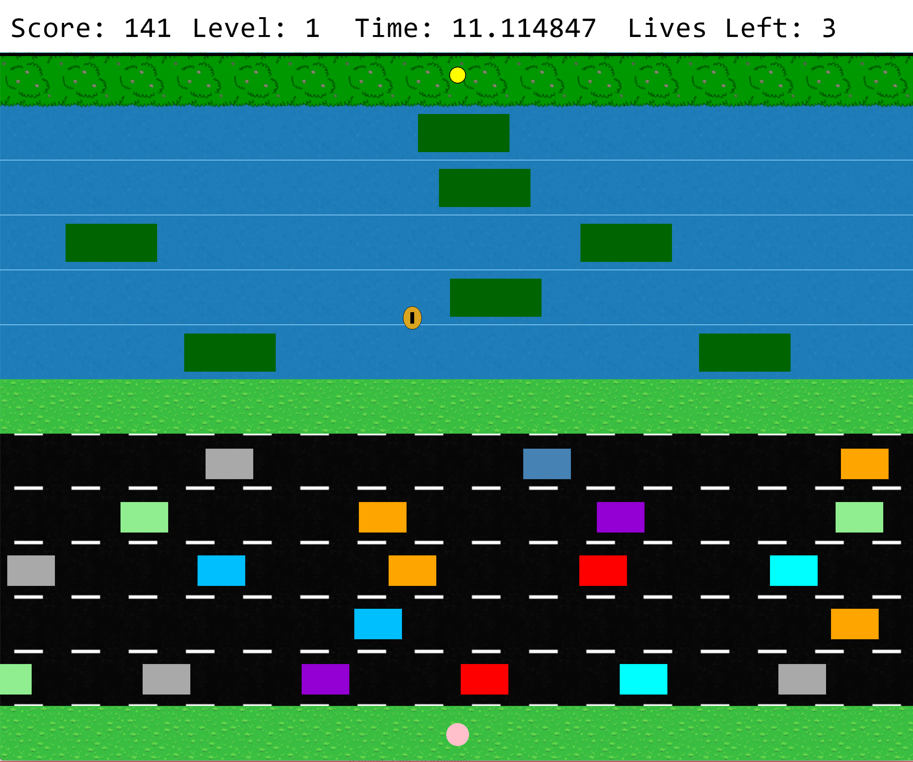

# Frogger 2.0
Frogger 2.0 is a newer modified version of the classic game Frogger.

## Dependencies

* [Cinder](https://libcinder.org/)
* [Microsoft Visual Studio 2017+](https://visualstudio.microsoft.com/)
* [CMake](https://cmake.org/)
* [Clion](https://www.jetbrains.com/clion/features/?gclid=Cj0KCQjwp86EBhD7ARIsAFkgakjrhP8EbaJBqpgsvF2C-3rDhu9bzbdrkQim510hLlYGH_8IAuOK2tIaAoiwEALw_wcB&gclsrc=aw.ds)

## Install and Play

* You must have Microsoft Visual Studio 2017 on Windows to build this project
* You will also need to run from CLion

## Controls

#### Keyboard

| Key       | Action                              |
|---------- |-------------------------------------|
| `W`       | Move Up                             |
| `A`       | Move Left                           |
| `S`       | Move Down                           |
| `D`       | Move Right                          |
| `SPACE`   | Enable Movement at Start of Level   |
